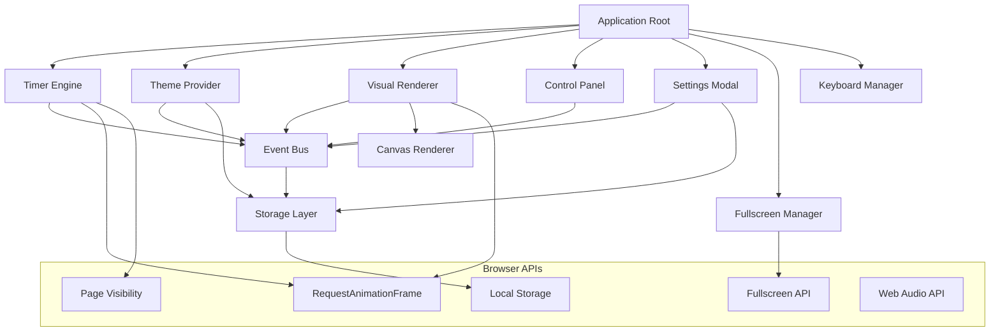
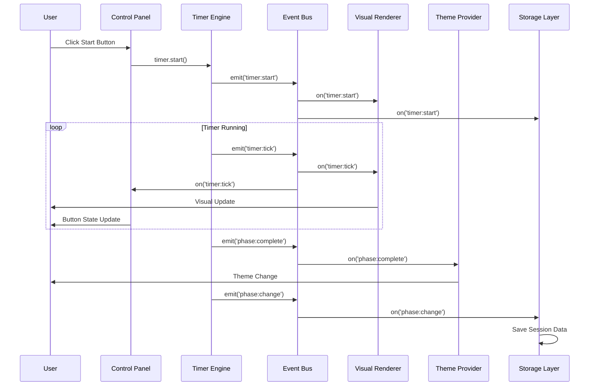
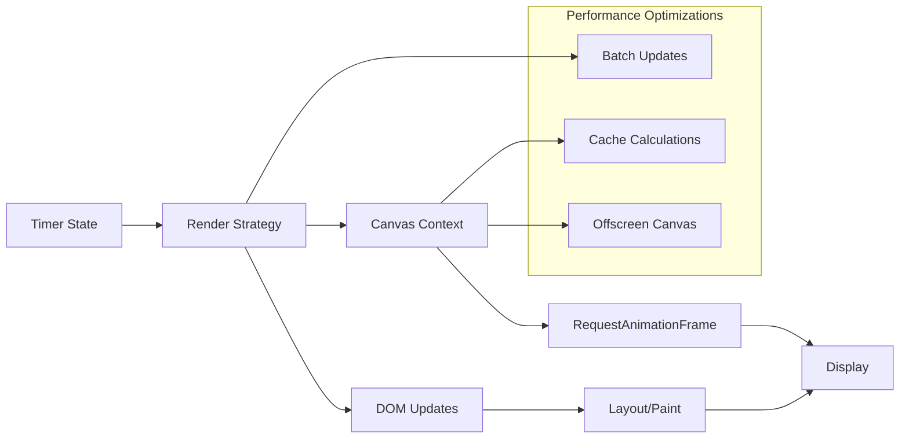

# Architecture Overview

Comprehensive architectural documentation for the Aesthetic Pomodoro Timer, covering system design, component relationships, data flow, and technical decisions.

## Table of Contents

1. [System Overview](#system-overview)
2. [Architecture Patterns](#architecture-patterns)
3. [Component Architecture](#component-architecture)
4. [Data Flow](#data-flow)
5. [Event System](#event-system)
6. [State Management](#state-management)
7. [Rendering Pipeline](#rendering-pipeline)
8. [Storage Architecture](#storage-architecture)
9. [Performance Architecture](#performance-architecture)
10. [Security Architecture](#security-architecture)
11. [Browser Compatibility](#browser-compatibility)
12. [Future Architecture](#future-architecture)

## System Overview

The Aesthetic Pomodoro Timer is built using a **Component-Based Architecture** with **Event-Driven Communication**, designed for modularity, testability, and maintainability.

### High-Level Architecture

```
┌─────────────────────────────────────────────────────────┐
│                    Browser Runtime                      │
├─────────────────────────────────────────────────────────┤
│  ┌─────────────┐  ┌─────────────┐  ┌─────────────┐    │
│  │    UI        │  │  Visual     │  │  Audio      │    │
│  │ Components   │  │ Renderer    │  │  Manager    │    │
│  └─────────────┘  └─────────────┘  └─────────────┘    │
├─────────────────────────────────────────────────────────┤
│  ┌─────────────┐  ┌─────────────┐  ┌─────────────┐    │
│  │   Timer     │  │   Theme     │  │ Keyboard    │    │
│  │  Engine     │  │ Provider    │  │ Manager     │    │
│  └─────────────┘  └─────────────┘  └─────────────┘    │
├─────────────────────────────────────────────────────────┤
│  ┌─────────────┐  ┌─────────────┐  ┌─────────────┐    │
│  │  Event      │  │  Storage    │  │   Utils     │    │
│  │   Bus       │  │   Layer     │  │ Functions   │    │
│  └─────────────┘  └─────────────┘  └─────────────┘    │
├─────────────────────────────────────────────────────────┤
│              Browser APIs & Web Platform               │
│    (LocalStorage, RequestAnimationFrame, Canvas,       │
│     Fullscreen, Page Visibility, Web Audio)            │
└─────────────────────────────────────────────────────────┘
```

### Core Principles

1. **Single Responsibility**: Each component has one clear purpose
2. **Loose Coupling**: Components communicate through events, not direct calls
3. **High Cohesion**: Related functionality grouped within components
4. **Dependency Inversion**: Components depend on abstractions, not implementations
5. **Open/Closed**: Open for extension, closed for modification

## Architecture Patterns

### 1. Singleton Pattern - Timer Engine

**Purpose**: Ensure single source of timing truth
**Implementation**: Module pattern with private state

```javascript
// TimerEngine (Singleton)
const TimerEngine = (() => {
  let instance = null;
  
  class Timer {
    constructor(config) {
      if (instance) return instance;
      this.state = { /* private state */ };
      instance = this;
    }
    
    // Public API methods
  }
  
  return Timer;
})();
```

**Benefits**:
- Prevents timing conflicts
- Centralized state management
- Global access point
- Memory efficient

### 2. Observer Pattern - Event System

**Purpose**: Enable loose coupling between components
**Implementation**: Custom event system built on DOM events

```javascript
// Event-driven communication
class EventBus extends EventTarget {
  emit(eventType, detail) {
    this.dispatchEvent(new CustomEvent(eventType, { detail }));
  }
  
  on(eventType, handler) {
    this.addEventListener(eventType, handler);
  }
  
  off(eventType, handler) {
    this.removeEventListener(eventType, handler);
  }
}
```

**Benefits**:
- Decoupled components
- Easy to test in isolation
- Extensible architecture
- Clear data flow

### 3. Strategy Pattern - Visual Renderer

**Purpose**: Support multiple visual display modes
**Implementation**: Interchangeable rendering strategies

```javascript
// Visual rendering strategies
class VisualRenderer {
  constructor() {
    this.strategies = new Map([
      ['progress', new ProgressStrategy()],
      ['shapes', new ShapesStrategy()],
      ['minimal', new MinimalStrategy()],
      ['creative', new CreativeStrategy()]
    ]);
  }
  
  setMode(mode) {
    this.currentStrategy = this.strategies.get(mode);
  }
  
  render(state) {
    this.currentStrategy.render(state, this.container);
  }
}
```

**Benefits**:
- Runtime mode switching
- Easy to add new modes
- Isolated mode logic
- Testable strategies

### 4. Context Provider Pattern - Theme System

**Purpose**: Global theme state accessible throughout app
**Implementation**: CSS custom properties + JS theme controller

```javascript
// Theme context management
class ThemeProvider {
  static applyTheme(themeName) {
    const theme = this.themes.get(themeName);
    const root = document.documentElement;
    
    // Apply CSS custom properties
    Object.entries(theme.colors).forEach(([key, value]) => {
      root.style.setProperty(`--${key}`, value);
    });
    
    // Notify subscribers
    this.emit('theme-changed', { themeName, theme });
  }
}
```

**Benefits**:
- Global theme access
- Runtime theme switching
- CSS-native performance
- Consistent styling

## Component Architecture

### Core Components Diagram



### 1. Application Root

**Responsibility**: Application lifecycle and component orchestration

```javascript
class App {
  constructor() {
    this.components = new Map();
    this.initialized = false;
  }
  
  async initialize() {
    // Initialize core components
    this.timer = new TimerEngine(defaultConfig);
    this.themeProvider = ThemeProvider;
    this.renderer = new VisualRenderer(container);
    this.controls = new ControlPanel(controlsContainer, this.timer);
    
    // Setup component communication
    this.setupEventHandlers();
    
    // Load user preferences
    await this.loadUserSettings();
    
    this.initialized = true;
    EventBus.emit('app:ready');
  }
  
  setupEventHandlers() {
    // Wire component events
    this.timer.addEventListener('tick', (state) => {
      this.renderer.render(state);
      this.controls.updateState(state);
    });
    
    EventBus.on('settings:changed', (settings) => {
      this.timer.configure(settings.timer);
      this.themeProvider.setTheme(settings.theme);
    });
  }
}
```

### 2. Timer Engine (Singleton)

**Responsibility**: Core timing logic with high precision

**Key Features**:
- Millisecond precision using `performance.now()`
- Background tab handling with Page Visibility API
- Web Worker support for background timing
- Automatic phase transitions
- Session tracking and statistics

```javascript
class TimerEngine {
  constructor(config) {
    this.config = { ...defaultConfig, ...config };
    this.state = this.createInitialState();
    this.rafId = null;
    this.listeners = new Map();
    
    // Background timing support
    this.setupPageVisibilityHandler();
    this.setupWebWorker();
  }
  
  start() {
    if (this.state.isRunning) return;
    
    this.state.isRunning = true;
    this.state.startTime = performance.now();
    this.startRenderLoop();
    
    this.emit('start', {
      phase: this.state.phase,
      totalTime: this.getCurrentPhaseTime()
    });
  }
  
  startRenderLoop() {
    const tick = (timestamp) => {
      this.updateState(timestamp);
      this.emit('tick', this.getState());
      
      if (this.state.isRunning) {
        this.rafId = requestAnimationFrame(tick);
      }
    };
    
    this.rafId = requestAnimationFrame(tick);
  }
  
  updateState(timestamp) {
    const elapsed = timestamp - this.state.startTime;
    const remaining = Math.max(0, this.state.totalTime - elapsed);
    
    this.state.remainingTime = remaining;
    this.state.progress = 1 - (remaining / this.state.totalTime);
    
    if (remaining === 0) {
      this.completePhase();
    }
  }
  
  completePhase() {
    const currentPhase = this.state.phase;
    const nextPhase = this.getNextPhase();
    
    this.state.phase = nextPhase;
    this.state.isRunning = false;
    
    this.emit('phase-change', {
      fromPhase: currentPhase,
      toPhase: nextPhase,
      cycle: this.state.currentCycle
    });
    
    if (this.config.autoStartBreaks || 
        (this.config.autoStartFocus && nextPhase === 'focus')) {
      setTimeout(() => this.start(), 1000);
    }
  }
}
```

### 3. Theme Provider (Static)

**Responsibility**: Theme management and CSS custom properties

**Key Features**:
- CSS custom properties for runtime theme switching
- Theme registration and validation
- Persistent theme preferences
- System theme detection (prefers-color-scheme)
- Custom theme creation support

```javascript
class ThemeProvider {
  static themes = new Map();
  static currentTheme = 'light';
  static listeners = new Set();
  
  static registerTheme(name, config) {
    const validatedConfig = this.validateThemeConfig(config);
    this.themes.set(name, validatedConfig);
    
    // Generate CSS custom properties
    this.generateThemeCSS(name, validatedConfig);
    
    this.emit('theme-registered', { name, config: validatedConfig });
  }
  
  static setTheme(themeName) {
    if (!this.themes.has(themeName)) {
      console.warn(`Theme '${themeName}' not found`);
      return;
    }
    
    const previousTheme = this.currentTheme;
    this.currentTheme = themeName;
    
    // Apply theme to document
    document.documentElement.setAttribute('data-theme', themeName);
    
    // Update CSS custom properties
    this.applyThemeProperties(themeName);
    
    // Persist preference
    Storage.set('theme', themeName);
    
    this.emit('theme-changed', {
      themeName,
      previousTheme,
      config: this.themes.get(themeName)
    });
  }
  
  static applyThemeProperties(themeName) {
    const theme = this.themes.get(themeName);
    const root = document.documentElement;
    
    // Apply color properties
    Object.entries(theme.colors).forEach(([key, value]) => {
      root.style.setProperty(`--color-${key}`, value);
    });
    
    // Apply typography properties
    Object.entries(theme.fonts).forEach(([key, value]) => {
      root.style.setProperty(`--font-${key}`, value);
    });
    
    // Apply spacing properties
    Object.entries(theme.spacing).forEach(([key, value]) => {
      root.style.setProperty(`--spacing-${key}`, value);
    });
  }
}
```

### 4. Visual Renderer (Strategy)

**Responsibility**: Visual display and animations

**Key Features**:
- Multiple rendering modes (Progress, Shapes, Minimal, Creative)
- Canvas-based animations for smooth performance
- Responsive design with CSS Grid/Flexbox
- RequestAnimationFrame for 60fps animations
- WebGL support for complex visuals (optional)

```javascript
class VisualRenderer {
  constructor(container, config = {}) {
    this.container = container;
    this.config = { ...defaultRenderConfig, ...config };
    this.currentStrategy = null;
    this.animationId = null;
    
    // Initialize rendering strategies
    this.strategies = new Map([
      ['progress', new ProgressRenderStrategy()],
      ['shapes', new ShapesRenderStrategy()],
      ['minimal', new MinimalRenderStrategy()], 
      ['creative', new CreativeRenderStrategy()]
    ]);
    
    this.setMode(this.config.mode);
    this.setupResizeObserver();
  }
  
  setMode(mode) {
    if (this.currentStrategy) {
      this.currentStrategy.cleanup(this.container);
    }
    
    this.currentStrategy = this.strategies.get(mode);
    this.currentStrategy.initialize(this.container, this.config);
    
    this.emit('mode-changed', { mode, previousMode: this.config.mode });
    this.config.mode = mode;
  }
  
  render(timerState) {
    if (!this.currentStrategy) return;
    
    // Prepare render context
    const renderContext = {
      state: timerState,
      container: this.container,
      theme: ThemeProvider.getCurrentTheme(),
      config: this.config
    };
    
    // Execute rendering strategy
    this.currentStrategy.render(renderContext);
    
    this.emit('render-complete', { mode: this.config.mode, state: timerState });
  }
  
  startAnimation() {
    if (this.animationId) return;
    
    const animate = (timestamp) => {
      if (this.currentStrategy.animate) {
        this.currentStrategy.animate(timestamp, this.container);
      }
      
      this.animationId = requestAnimationFrame(animate);
    };
    
    this.animationId = requestAnimationFrame(animate);
    this.emit('animation-start', { mode: this.config.mode });
  }
  
  stopAnimation() {
    if (this.animationId) {
      cancelAnimationFrame(this.animationId);
      this.animationId = null;
      this.emit('animation-complete', { mode: this.config.mode });
    }
  }
}
```

## Data Flow

### Unidirectional Data Flow

The application follows a unidirectional data flow pattern:

```
User Interaction → Component → Event Bus → State Change → UI Update
```

### Detailed Data Flow Diagram



### State Flow Patterns

**Timer State Flow**
```
Idle → Running → Paused → Running → Complete → Next Phase → Idle
```

**Theme State Flow**
```
Load Saved Theme → Apply CSS Properties → Listen for Changes → Update Properties → Save Theme
```

**Settings State Flow**
```
Load Defaults → Load Saved Settings → User Changes → Validate → Apply → Save → Notify Components
```

## Event System

### Event Architecture

The application uses a centralized event system built on the DOM's native `EventTarget` interface:

```javascript
class EventBus extends EventTarget {
  // Singleton instance
  static instance = new EventBus();
  
  static emit(eventType, detail = {}) {
    this.instance.dispatchEvent(
      new CustomEvent(eventType, { 
        detail, 
        bubbles: false, 
        cancelable: true 
      })
    );
  }
  
  static on(eventType, handler, options = {}) {
    this.instance.addEventListener(eventType, handler, options);
  }
  
  static off(eventType, handler) {
    this.instance.removeEventListener(eventType, handler);
  }
  
  static once(eventType, handler) {
    this.instance.addEventListener(eventType, handler, { once: true });
  }
}
```

### Event Categories

**Timer Events**
- `timer:start` - Timer started
- `timer:pause` - Timer paused
- `timer:reset` - Timer reset
- `timer:tick` - Timer tick (every second)
- `timer:complete` - Phase completed
- `timer:phase-change` - Phase transition

**UI Events**  
- `ui:button-click` - UI button interaction
- `ui:modal-open` - Modal opened
- `ui:modal-close` - Modal closed
- `ui:fullscreen-toggle` - Fullscreen toggled

**Theme Events**
- `theme:changed` - Theme switched
- `theme:registered` - New theme added
- `theme:custom-applied` - Custom properties applied

**Settings Events**
- `settings:changed` - Settings updated
- `settings:saved` - Settings persisted
- `settings:reset` - Settings reset to defaults

**System Events**
- `app:ready` - Application initialized
- `app:error` - Error occurred
- `storage:changed` - Storage updated
- `visibility:changed` - Tab visibility changed

### Event Patterns

**Request/Response Pattern**
```javascript
// Request with callback
EventBus.emit('settings:request', { 
  category: 'timer',
  callback: (settings) => {
    // Handle settings response
  }
});

// Response handler
EventBus.on('settings:request', (event) => {
  const settings = getSettings(event.detail.category);
  event.detail.callback(settings);
});
```

**Command Pattern**
```javascript
// Commands for undo/redo functionality
EventBus.emit('command:execute', {
  type: 'theme-change',
  payload: { theme: 'dark' },
  undo: { theme: 'light' }
});
```

## State Management

### State Architecture

Each component manages its own state while sharing global state through the event system:

```javascript
class ComponentState {
  constructor(initialState = {}) {
    this.state = { ...initialState };
    this.previousState = null;
    this.listeners = new Set();
  }
  
  setState(newState) {
    this.previousState = { ...this.state };
    this.state = { ...this.state, ...newState };
    
    // Notify listeners of state change
    this.listeners.forEach(listener => {
      listener(this.state, this.previousState);
    });
    
    // Emit global state change event
    EventBus.emit(`${this.componentName}:state-changed`, {
      state: this.state,
      previousState: this.previousState
    });
  }
  
  getState() {
    return { ...this.state }; // Return copy to prevent mutation
  }
  
  subscribe(listener) {
    this.listeners.add(listener);
    return () => this.listeners.delete(listener); // Unsubscribe function
  }
}
```

### Global State Management

**Application State Structure**
```javascript
const AppState = {
  timer: {
    phase: 'focus',
    isRunning: false,
    remainingTime: 1500000,
    totalTime: 1500000,
    currentCycle: 1,
    completedSessions: 0,
    progress: 0.0
  },
  
  ui: {
    theme: 'light',
    visualMode: 'progress',
    isFullscreen: false,
    settingsOpen: false,
    currentTab: 'timer'
  },
  
  settings: {
    focusTime: 1500000,      // 25 minutes
    shortBreak: 300000,      // 5 minutes
    longBreak: 900000,       // 15 minutes
    audioEnabled: true,
    animationsEnabled: true,
    backgroundTiming: true
  },
  
  session: {
    sessionsToday: 0,
    focusTimeToday: 0,
    currentStreak: 0,
    bestStreak: 0,
    completionRate: 0.85
  }
};
```

### State Persistence Strategy

**Local Storage Integration**
```javascript
class PersistentState {
  static keys = {
    SETTINGS: 'pomodoro-settings',
    THEME: 'pomodoro-theme',
    SESSION_DATA: 'pomodoro-session',
    USER_PREFERENCES: 'pomodoro-preferences'
  };
  
  static save(key, data) {
    try {
      const serialized = JSON.stringify(data);
      localStorage.setItem(this.keys[key], serialized);
      EventBus.emit('storage:saved', { key, data });
    } catch (error) {
      console.error('Failed to save to storage:', error);
      EventBus.emit('storage:error', { key, error });
    }
  }
  
  static load(key, defaultValue = null) {
    try {
      const serialized = localStorage.getItem(this.keys[key]);
      return serialized ? JSON.parse(serialized) : defaultValue;
    } catch (error) {
      console.error('Failed to load from storage:', error);
      return defaultValue;
    }
  }
  
  static clear(key = null) {
    if (key) {
      localStorage.removeItem(this.keys[key]);
    } else {
      Object.values(this.keys).forEach(k => localStorage.removeItem(k));
    }
    EventBus.emit('storage:cleared', { key });
  }
}
```

## Rendering Pipeline

### Rendering Architecture

The rendering pipeline is optimized for smooth 60fps performance:



### Render Strategies

**Progress Mode Strategy**
```javascript
class ProgressRenderStrategy {
  initialize(container, config) {
    this.canvas = document.createElement('canvas');
    this.ctx = this.canvas.getContext('2d');
    this.setupCanvas(container);
  }
  
  render(renderContext) {
    const { state, theme, config } = renderContext;
    const { progress } = state;
    
    // Clear canvas
    this.ctx.clearRect(0, 0, this.canvas.width, this.canvas.height);
    
    // Draw background circle
    this.drawCircle({
      radius: this.radius,
      strokeStyle: theme.colors.secondary,
      lineWidth: this.lineWidth
    });
    
    // Draw progress arc
    this.drawArc({
      radius: this.radius,
      startAngle: -Math.PI / 2,
      endAngle: -Math.PI / 2 + (progress * 2 * Math.PI),
      strokeStyle: theme.colors.primary,
      lineWidth: this.lineWidth
    });
    
    // Draw time text
    this.drawText({
      text: formatTime(state.remainingTime),
      font: `${theme.fonts.timer} ${theme.fonts.primary}`,
      fillStyle: theme.colors.text,
      textAlign: 'center',
      textBaseline: 'middle'
    });
  }
  
  animate(timestamp, container) {
    // Smooth transitions and micro-animations
    this.updateAnimationValues(timestamp);
    this.render(this.lastRenderContext);
  }
  
  cleanup(container) {
    // Remove canvas and clean up resources
    if (this.canvas.parentNode) {
      this.canvas.parentNode.removeChild(this.canvas);
    }
  }
}
```

### Performance Optimizations

**Canvas Optimizations**
- Offscreen canvas for complex rendering
- Canvas context caching
- Minimal redraw regions
- GPU acceleration when available

**DOM Optimizations**
- Batch DOM updates
- Use CSS transforms for animations
- Minimize layout thrashing
- Virtual scrolling for long lists

**Memory Management**
- Clean up event listeners
- Release canvas contexts
- Clear animation frames
- Garbage collection friendly patterns

## Storage Architecture

### Storage Strategy

The application uses a layered storage approach:

```
Application Data
       ↓
Storage Abstraction Layer
       ↓
Browser Storage APIs
(LocalStorage, IndexedDB, Cache API)
```

### Storage Implementation

```javascript
class StorageManager {
  constructor() {
    this.adapters = new Map([
      ['localStorage', new LocalStorageAdapter()],
      ['indexedDB', new IndexedDBAdapter()],
      ['memory', new MemoryAdapter()]
    ]);
    
    this.currentAdapter = this.selectBestAdapter();
  }
  
  selectBestAdapter() {
    // Prefer IndexedDB for large data, LocalStorage for simple data
    if (this.isIndexedDBAvailable()) {
      return this.adapters.get('indexedDB');
    } else if (this.isLocalStorageAvailable()) {
      return this.adapters.get('localStorage');
    } else {
      return this.adapters.get('memory');
    }
  }
  
  async get(key) {
    try {
      return await this.currentAdapter.get(key);
    } catch (error) {
      console.warn('Storage get failed, falling back:', error);
      return await this.fallbackGet(key);
    }
  }
  
  async set(key, value) {
    try {
      await this.currentAdapter.set(key, value);
      EventBus.emit('storage:set', { key, value });
    } catch (error) {
      console.error('Storage set failed:', error);
      EventBus.emit('storage:error', { key, error });
    }
  }
}
```

## Performance Architecture

### Performance Monitoring

```javascript
class PerformanceMonitor {
  constructor() {
    this.metrics = new Map();
    this.observers = new Map();
    this.setupObservers();
  }
  
  setupObservers() {
    // Performance Observer for measuring render performance
    if ('PerformanceObserver' in window) {
      const observer = new PerformanceObserver((list) => {
        for (const entry of list.getEntries()) {
          this.recordMetric(entry.name, entry.duration);
        }
      });
      
      observer.observe({ entryTypes: ['measure', 'navigation'] });
    }
    
    // Memory usage monitoring
    if ('memory' in performance) {
      setInterval(() => {
        this.recordMemoryUsage();
      }, 30000);
    }
  }
  
  measure(name, fn) {
    performance.mark(`${name}-start`);
    const result = fn();
    performance.mark(`${name}-end`);
    performance.measure(name, `${name}-start`, `${name}-end`);
    return result;
  }
  
  recordMetric(name, value) {
    if (!this.metrics.has(name)) {
      this.metrics.set(name, []);
    }
    
    const values = this.metrics.get(name);
    values.push({ value, timestamp: Date.now() });
    
    // Keep only recent measurements
    if (values.length > 100) {
      values.shift();
    }
  }
}
```

### Performance Budgets

**Target Performance Metrics**
- Initial load time: < 2 seconds
- Timer precision: ±50ms accuracy
- Animation frame rate: 60fps
- Memory usage: < 50MB
- Bundle size: < 200KB gzipped

## Security Architecture

### Security Principles

1. **Client-Side Security**: No sensitive data transmitted
2. **Input Validation**: All user inputs validated
3. **Content Security Policy**: Strict CSP headers
4. **Sanitization**: User content properly sanitized

### Security Implementation

```javascript
class SecurityManager {
  static sanitizeInput(input, type) {
    switch (type) {
      case 'time':
        return this.sanitizeTime(input);
      case 'theme':
        return this.sanitizeTheme(input);
      case 'string':
        return this.sanitizeString(input);
      default:
        return null;
    }
  }
  
  static sanitizeTime(timeString) {
    // Only allow valid time format: HH:MM or MM:SS
    const timePattern = /^([0-9]{1,2}):([0-9]{2})$/;
    const match = timeString.match(timePattern);
    
    if (!match) return null;
    
    const minutes = parseInt(match[1]);
    const seconds = parseInt(match[2]);
    
    // Validate ranges
    if (minutes < 0 || minutes > 1440) return null; // Max 24 hours
    if (seconds < 0 || seconds > 59) return null;
    
    return { minutes, seconds };
  }
  
  static validateThemeConfig(config) {
    const allowedKeys = ['colors', 'fonts', 'spacing', 'animations'];
    const colorPattern = /^#([A-Fa-f0-9]{6}|[A-Fa-f0-9]{3})$/;
    
    // Validate structure
    for (const key of Object.keys(config)) {
      if (!allowedKeys.includes(key)) {
        throw new Error(`Invalid theme config key: ${key}`);
      }
    }
    
    // Validate colors
    if (config.colors) {
      for (const [key, value] of Object.entries(config.colors)) {
        if (!colorPattern.test(value)) {
          throw new Error(`Invalid color value: ${value}`);
        }
      }
    }
    
    return true;
  }
}
```

## Browser Compatibility

### Compatibility Matrix

| Feature | Chrome | Firefox | Safari | Edge | Fallback |
|---------|--------|---------|--------|------|----------|
| CSS Custom Properties | 49+ | 31+ | 9.1+ | 79+ | Static themes |
| RequestAnimationFrame | 24+ | 23+ | 6.1+ | 12+ | setTimeout |
| Canvas API | 4+ | 2+ | 3.1+ | 9+ | DOM rendering |
| Fullscreen API | 71+ | 64+ | 16.4+ | 79+ | Maximize viewport |
| Page Visibility | 33+ | 18+ | 7+ | 12+ | Focus/blur events |
| Web Audio API | 36+ | 25+ | 14.1+ | 79+ | HTML5 audio |
| Local Storage | 4+ | 3.5+ | 4+ | 8+ | Memory storage |

### Progressive Enhancement Strategy

```javascript
class FeatureDetection {
  static features = {
    customProperties: this.testCustomProperties(),
    requestAnimationFrame: 'requestAnimationFrame' in window,
    canvas: this.testCanvas(),
    fullscreen: this.testFullscreen(),
    webAudio: this.testWebAudio(),
    localStorage: this.testLocalStorage()
  };
  
  static testCustomProperties() {
    if (!window.CSS || !window.CSS.supports) return false;
    return CSS.supports('--test', 'value');
  }
  
  static testCanvas() {
    const canvas = document.createElement('canvas');
    return !!(canvas.getContext && canvas.getContext('2d'));
  }
  
  static applyFallbacks() {
    if (!this.features.customProperties) {
      // Use class-based theming
      document.body.classList.add('fallback-theming');
    }
    
    if (!this.features.requestAnimationFrame) {
      // Polyfill with setTimeout
      window.requestAnimationFrame = (callback) => {
        return setTimeout(callback, 16);
      };
    }
    
    if (!this.features.canvas) {
      // Fall back to DOM-based rendering
      VisualRenderer.setFallbackMode('dom');
    }
  }
}
```

## Future Architecture

### Planned Enhancements

**Module Federation**
- Micro-frontend architecture for extensibility
- Plugin system for third-party extensions
- Theme marketplace integration

**Web Components**
- Custom element definitions for reusability
- Shadow DOM encapsulation
- Framework-agnostic components

**WebAssembly Integration**
- High-performance timer calculations
- Complex visual effects
- Audio processing

**Progressive Web App**
- Service Worker for offline functionality
- Web App Manifest for installation
- Background sync for session data

**Real-time Collaboration**
- WebRTC for shared sessions
- Collaborative productivity tracking
- Team pomodoro sessions

### Migration Strategy

**Version 2.0 Architecture Goals**
1. **Modular Architecture**: Plugin-based extensibility
2. **Performance**: WebAssembly for intensive operations
3. **Offline-First**: Service Worker integration
4. **Real-time**: WebSocket/WebRTC communication
5. **Cross-Platform**: Web Components for framework compatibility

**Migration Path**
```
v1.0 (Current) → v1.5 (Web Components) → v2.0 (Micro-frontends) → v3.0 (Native Integration)
```

---

## Architecture Decision Records (ADRs)

### ADR-001: Event-Driven Architecture
**Status**: Accepted  
**Decision**: Use event-driven architecture for component communication  
**Rationale**: Enables loose coupling, easier testing, and extensibility  
**Consequences**: Slightly more complex debugging, but better maintainability  

### ADR-002: CSS Custom Properties for Theming
**Status**: Accepted  
**Decision**: Use CSS custom properties instead of CSS-in-JS  
**Rationale**: Better performance, native browser support, simpler implementation  
**Consequences**: Limited IE support, but acceptable for target audience  

### ADR-003: Canvas for Visual Rendering
**Status**: Accepted  
**Decision**: Use Canvas API for complex visual modes  
**Rationale**: Better performance for animations, pixel-perfect control  
**Consequences**: More complex than DOM-based rendering, but necessary for advanced visuals  

### ADR-004: Singleton Timer Engine
**Status**: Accepted  
**Decision**: Implement timer as singleton  
**Rationale**: Single source of truth for timing, prevents conflicts  
**Consequences**: Less flexible for multiple timers, but simpler for single-timer app  

---

**Architecture Version**: 1.0.0  
**Last Updated**: 2025-09-01  
**Next Review**: 2025-12-01  

*This architecture is designed for growth, performance, and maintainability. All architectural decisions are documented and reversible as requirements evolve.*